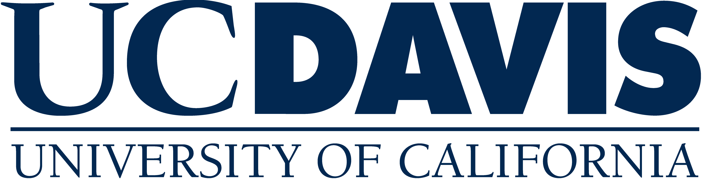

  

## About Me

I am a Computer Science Ph.D. student at the University of California, Davis, advised by Prof. Cindy Rubio-González.
Before UC Davis, I worked as a Software Engineer for over three years, specializing in enterprise system development, data migration, and server maintenance.

 

My research interests focus on **Software Engineering**, **Machine Learning**, and **High Performance Computing**.

 

## Education

  <h3> University of California, Davis</h3>
  <h3 style="text-align: right;">Sept 2023 - Present</h3>

Doctor of Philosophy, Computer Science

*Davis, CA, USA*  

    

  <h3> Konkuk University</h3>
  <h3 style="text-align: right;">Mar 2014 - Feb 2018</h3>

Bachelor of Science, Computer Engineering

*Chungju, Republic of Korea*

    



## Teaching Assistance

- **[ECS 140A]** Programming Languages, UC Davis, Spring 2024

 

## Experience

  <h3> Research Assistant</h3>
  <h3 style="text-align: right;">Sept 2023 - present</h3>

**Advisor**: Prof. Cindy Rubio-González

Programming Languages and Software Engineering Group (PLSE)

University of California, Davis

*Davis, CA, USA*

    

  <h3> Software Engineer</h3>
  <h3 style="text-align: right;">Oct 2018 - Mar 2022</h3>

 
KEPCO Knowledge, Data & Network Co.

*Naju, Korea*

    

  <h3> IT Intern</h3>
  <h3 style="text-align: right;">Jul 2018 - Sep 2018</h3>

 
KEPCO Knowledge, Data & Network Co.

*Naju, Korea*

    

  <h3> IT Intern</h3>
  <h3 style="text-align: right;">Jun 2018 - Jul 2018</h3>

Korea Institute of Patent Information

*Daejun, Korea*

    

  <h3> IT Intern</h3>
  <h3 style="text-align: right;">Apr 2018 - May 2018</h3>

Korea Power Exchange

*Naju, Korea*

    

## Acaedmic Service

- **[Co-reviewer]** ICSE 2025 Research Track
- **[Co-reviewer]** PLDI 2024 Research Track

<!-- 
**[Feb. 2020]** Our paper about incremental learning is accepted to CVPR 2020.

**[Feb. 2020]** We will host the ACM Multimedia Asia 2020 conference in Singapore!

**[Sept. 2019]** Our paper about few-shot learning is accepted to NeurIPS 2019.

**[Mar. 2019]** Our paper about few-shot learning is accepted to CVPR 2019.


-->
